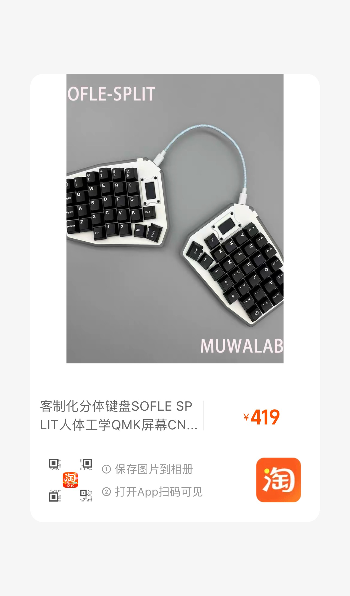
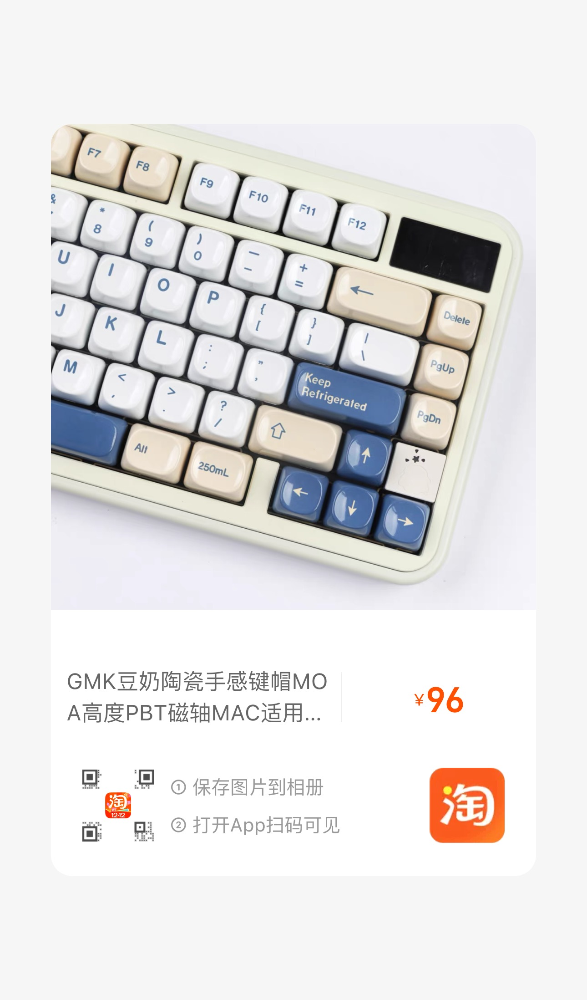

# Firmware of My Personal Keyboard

This repo is forked from [qmk-firmware](https://github.com/qmk/qmk_firmware). Changes are made to support my personal keyboard.

The major changes are done in the folder `keyboards/sofle_pico/`.

## 我的键盘配置 My Keyboard Configuration

### Chinese

1. Sofle pico键盘，购买自淘宝：

  

2. Cherry 红轴（70颗），购买自京东旗舰店

3. 豆奶键帽，购买自淘宝：

  

### 价格

| 物品 | 价格 |
| ---- | ---- |
| 键盘 | 399  |
| 轴体 | 95   |
| 键帽 | 89   |
| 总计 | 583  |

### English

1. Sofle Pico Keyboard, purchased from Taobao:

 

2. Cherry Red Switches (70 pieces), purchased from JD.com Flagship Store

3. Dou Nai Keycaps, purchased from Taobao:

 

### Price

| Item     | Price (CNY) |
| -------- | ----------- |
| Keyboard | 399         |
| Switches | 95          |
| Keycaps  | 89          |
| Total    | 583         |

## Setup

1. Run `qmk compile -kb sofle_pico -km lzx --compiledb` to generate the `compile_commands.json` file.
2. Run `make sofle_pico:lzx:flash` to build the firmware and flash to the keyboard.
3. Hold `fn + b` on the left keyboard to enter the bootloader mode and wait for it the finish flashing.
4. For the right split, disconnect to the lieft halft first, and hold the top-right button when connecting to the computer to enter the bootloader mode, and run the command in Step 2 to flash the keyboard.
